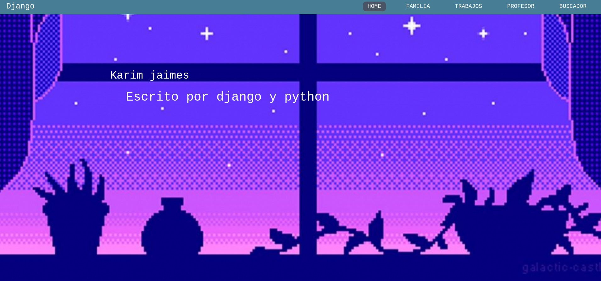

# Bienvenidos 
## Proyecto de karim
###  Aqui esta la guia  
paso 1
```bash
git clone https://github.com/karimdev96/Proyecto.git
```
paso 2
```bash
cd Proyecto
```
paso 3
```bash
python manager.py runserver
```
or
```bash
python3 manager.py runserver
```

login bd
```bash
admin
admin123
```
link para entrar pagina web
```bash
http://localhost:8000/
```

# imagenes

